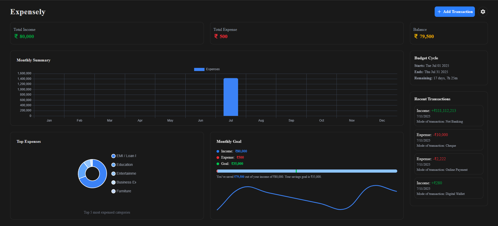

# Expensely Frontend

A modern, responsive frontend for Expensely – a smart personal finance management app that allows users to track their income, expenses, savings, and financial goals with ease.

## 🚀 Features

- 🧾 Add, update, delete transactions (income or expense)
- 📊 Visual dashboards for monthly summary and savings
- 🔍 Filter, search, and paginate transaction history
- 💸 Categorized savings with real-time tracking
- 🛠️ User settings (profile, privacy, appearance)
- 🧩 Responsive and light-dark theme switching

## 🖥️ Tech Stack

- **Framework**: React.js (Vite)
- **Styling**: TailwindCSS
- **Charts**: chart.js
- **State Management**: Redux Toolkit
- **API**: Axios with Interceptors
- **Routing**: React Router
- **Smooth Scrolling**: Lenis
- **Animations**: Motion

## 📸 Screenshots

